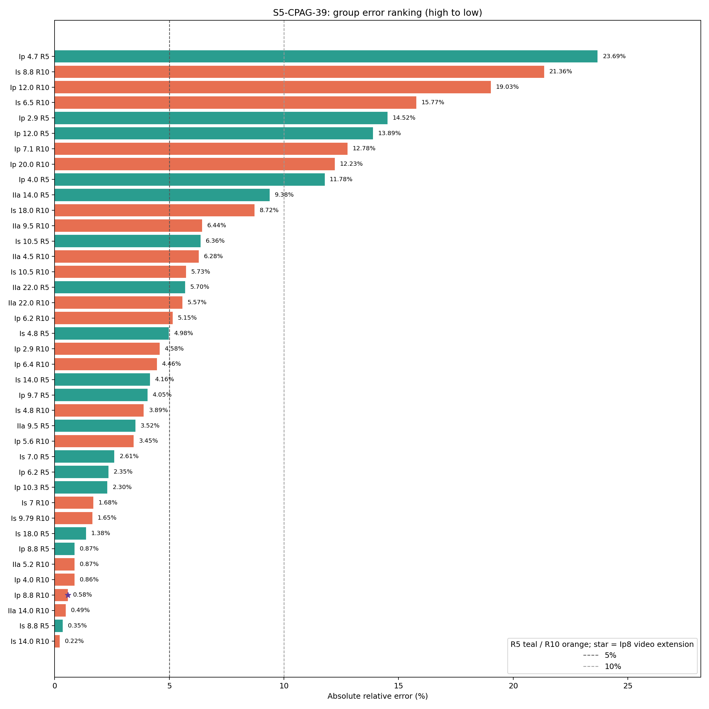

# S5-CPAG-39 组误差排序

coverage **39/39**；median **4.577%**；MAE **0.613 mm**；p95 **19.263%**；max **23.685%**。

图中从上到下为绝对相对误差从高到低。青色 R5，橙色 R10；紫色星号为 Ip8 R10 的原视频中心线内环适配，其余 38 组均来自原冻结 S5-CPAG 主线。

- 完整排序 CSV：`tables/group_errors_descending.csv`
- 机器可读定义：`MAINLINE_MANIFEST.json`
